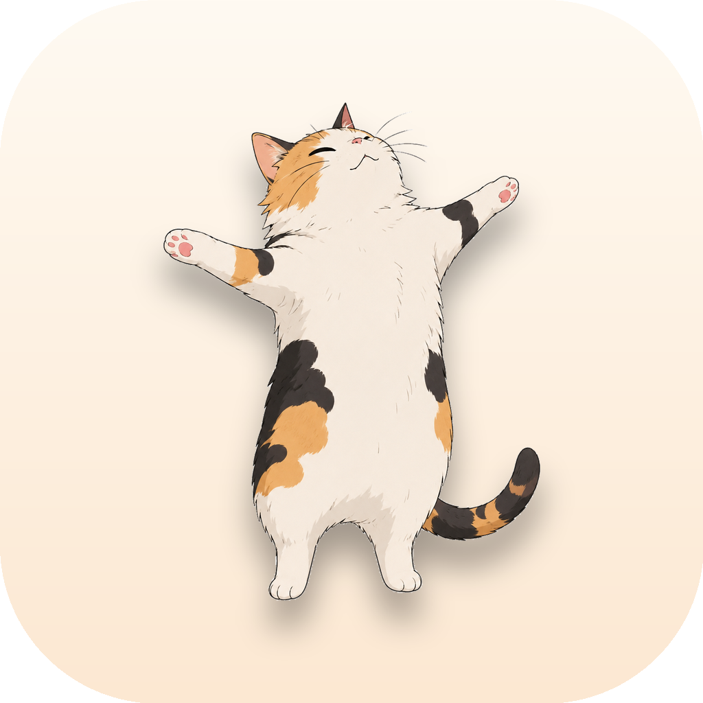

# 🐈 Stretch Cat

A tiny macOS menu-bar app that reminds you to stand up and stretch every two
hours — starring an animated calico cat you can follow along with.

<p align="center">
  
</p>

- Lives in the **menu bar** (no Dock icon), with a custom cat-face icon.
- Every 2 hours: a **notification** + a window where the **cat plays a full
  stretch routine** on a loop. Snooze 10 min or mark Done.
- Lively dropdown: live cat video, **countdown to the next stretch**,
  *Stretch now*, interval picker (1h / 2h / 3h), pause, and launch-at-login.

## Install

**Homebrew (recommended)**
```bash
brew install --cask vominhkhoii/stretch-cat/stretch-cat
```

**Direct download**
Grab `StretchCat.dmg` from the [latest release](https://github.com/VoMinhKhoii/StretchCat/releases),
open it, and drag **Stretch Cat** to Applications.

> Requires macOS 13 (Ventura) or later. Allow notifications on first launch so
> the reminders can reach you.

## Build from source
```bash
git clone https://github.com/VoMinhKhoii/StretchCat
cd StretchCat
./build.sh            # builds build/StretchCat.app (universal, ad-hoc signed)
open build/StretchCat.app
```
Requires the Xcode command-line tools and Python + Pillow (only if you want to
regenerate the art: `scripts/prep_image.py`, `make_icon.sh`,
`make_menubar_icon.py`).

## How it works
- SwiftUI `MenuBarExtra` (`.window` style) for the panel; an `AVPlayerLooper`
  plays `Resources/cat_stretch.mp4` in the popup and the panel header.
- `ReminderManager` schedules a `Timer` at the chosen interval, posts a
  `UNUserNotificationCenter` banner, and pops the cat window.
- Settings persist in `UserDefaults`; launch-at-login uses `SMAppService`.

## Publishing (maintainers)

Local builds are ad-hoc signed (fine for yourself). Public releases are
**notarized** so they open with no Gatekeeper warning.

**One-time setup**
1. Create a **Developer ID Application** certificate:
   Xcode → Settings → Accounts → *(your team)* → Manage Certificates →
   **+** → *Developer ID Application*.
2. Store notarytool credentials (uses an app-specific password from
   appleid.apple.com):
   ```bash
   xcrun notarytool store-credentials stretchcat \
     --apple-id "you@example.com" --team-id ZNG57U88R5
   ```

**Cut a release** (build → notarize → DMG → GitHub release → cask bump)
```bash
DEV_ID_APP="Developer ID Application: Khoi Vo (ZNG57U88R5)" \
NOTARY_PROFILE="stretchcat" \
VERSION="1.0.0" \
./scripts/release.sh
```

**Mac App Store** — see [APPSTORE.md](APPSTORE.md).

## License
The code is MIT. The cat artwork/video are the author's own.
